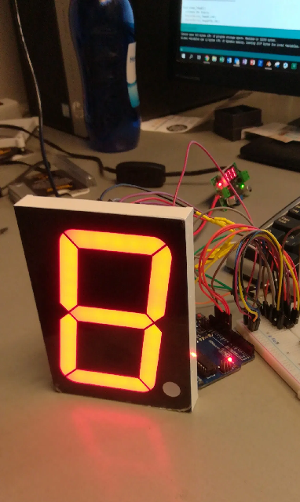

# large-7-segment-led-display
How to build a countdown timer using four 4 inch / 10 cm tall 7 segment LED displays

See https://www.sabulo.com/sb/arduino/using-7-segment-led-displays-part-3/ for details.

The displays used in this project are similar to this:

https://www.ebay.com/itm/Large-10cm-4-inch-YELLOW-7-segment-LED-display-common-Anode-EU-seller/223965092374?hash=item34255c1a16:g:uA4AAOSwNphWYHUN

It is important that the displays have a common anode, not common cathode.

The shift registers used in this project are TPIC6B595 chips.

See it in operation:

https://youtu.be/i9dO-dGZF3w
